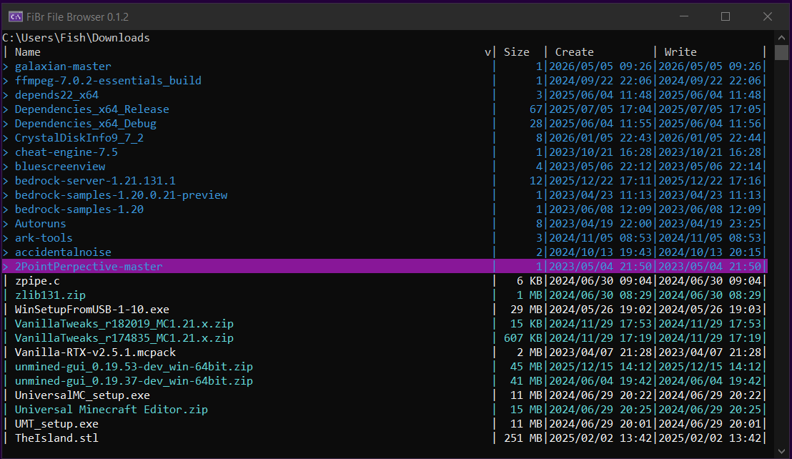
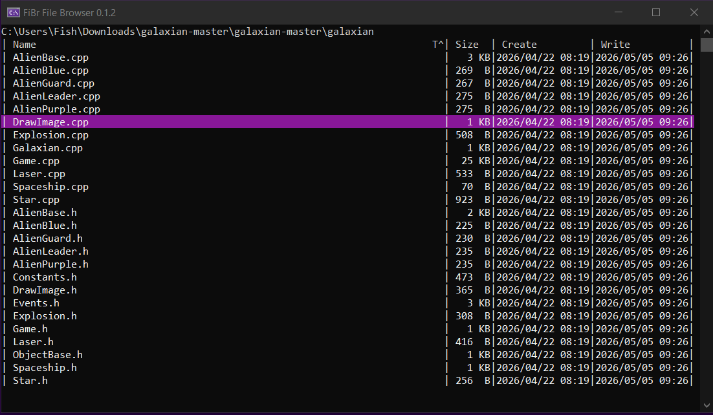

# Terminal <ins>FI</ins>le <ins>BR</ins>owser 
 
Blue entries are directories. 
Cyan entries are archives. 
White entries are files. 

## Controls: 
- Arrow keys: 
  - Up and Down scroll up and down (holding control scrolls faster)
  - Right on a directory goes into it
  - Left goes back a directory
  - Holding control disables getting subdirectory item count
    - ex: (massive speedup for "C:\Windows\WinSxS" ~16,000 items)
- Sorting: 
  - Pressing the same key toggles ascending/decending
  - N sorts by name
  - T sorts by type
  - S sorts by size/count
  - C sorts by creation date
  - W sorts by last write date
- Escape exits program 

## Screenshots: 
 
 
